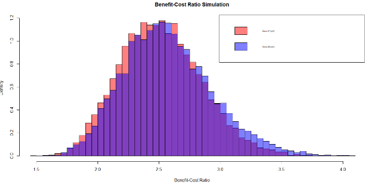

# Monte Carlo Simulations for Dam Construction BCR Analysis

## Introduction
This project uses Monte Carlo simulations to analyze the Benefit-Cost Ratios (BCR) for two dam construction projects. The goal is to assess the economic viability of each project by simulating random samples of benefits and costs using triangular distributions.

## Methodology
- **Monte Carlo Simulations**: 10,000 iterations were run to generate BCRs for each dam.
- **Triangular Distributions**: Custom distributions were used for benefits and costs.
- **Statistical Analysis**: Mean, standard deviation, and probability thresholds were calculated.

### Overlayed Histograms for Dam 1 and Dam 2

## References
- Boardman, A. E., et al. (2018). Cost-benefit analysis: concepts and practice.
- Palisade Corporation. (2019). Monte Carlo Simulation.
